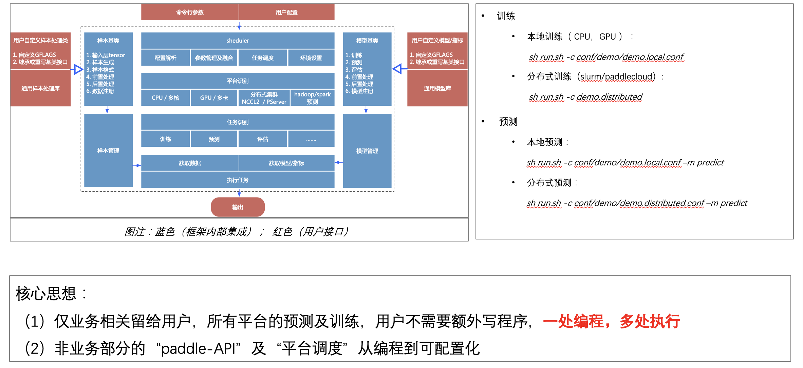
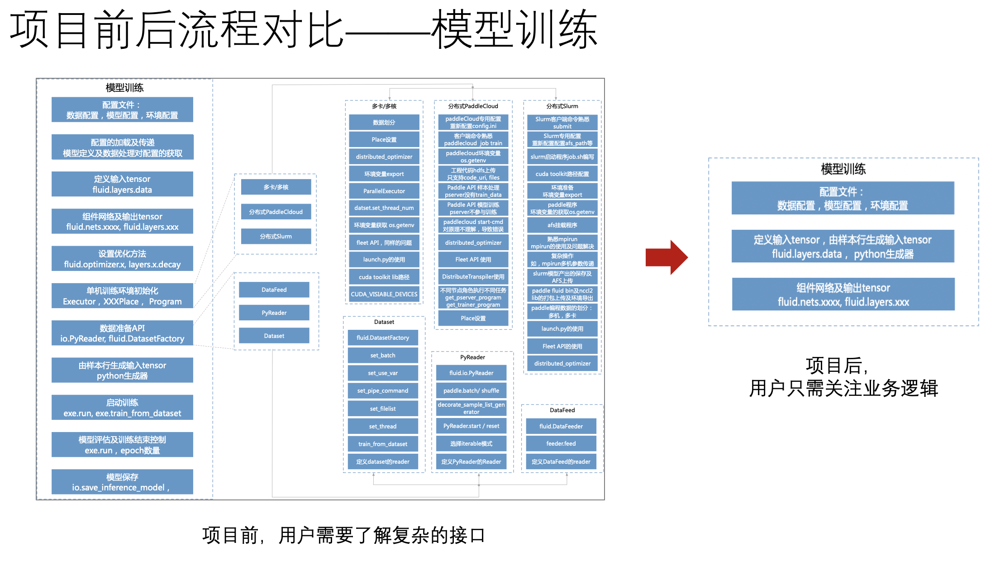
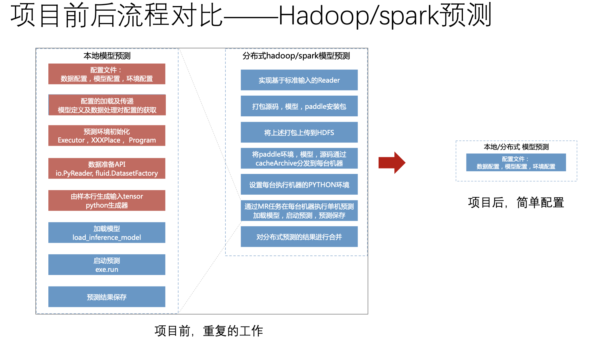

# Easy Paddle, Effective Paddle

 

**EPEP** is an Application Framework for PaddlePaddle, to make everyone can easily learn and use.

## 目录
* [环境搭建](#环境搭建)
* [框架说明](#框架说明)
* [使用说明](#使用说明)

## 环境搭建

1. 获取PaddlePaddle v1.5.1版本以上

2. 配置修改conf/var_sys.conf

## 框架说明

### 整体框架

## 使用说明

1. 定义输入

2. 组网

3. 配置&运行
